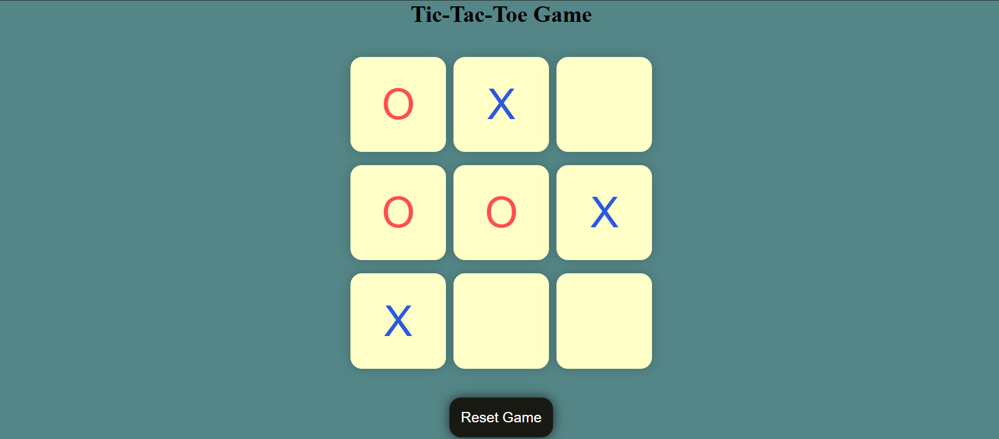
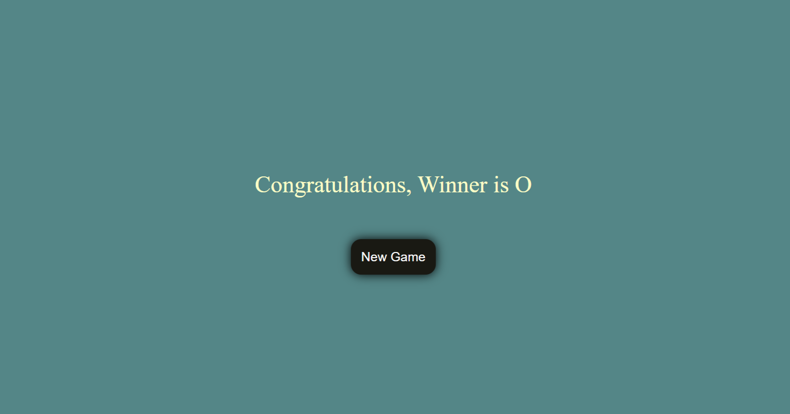

# 🎮 Tic Tac Toe Game

A basic Tic Tac Toe web game built with HTML, CSS, and JavaScript.

---

## 📑 Table of Contents

- [Description](#-description)
- [Live Demo](#-live-demo)
- [Screenshots](#-screenshots)
- [Features](#-features)
- [Technologies Used](#️-technologies-used)
- [Project Structure](#-project-structure)
- [How to Run the Project](#️-how-to-run-the-project)
- [Concepts Used](#-concepts-used)
- [Author](#-author)

---

## 📌 Description

This is a simple two-player Tic Tac Toe game played in the browser.  
The game uses predefined win patterns to detect the winner. As soon as a player wins, the winner is displayed and a new game option appears. In case of a draw, the game can be reset using the reset button.

---

## 🌐 Live Demo

Play the game here:
👉 https://arnav-sirkhal.github.io/tic-tac-toe-html-css-js/

---

## 📸 Screenshots

### 🎯 Game Board

<p align="center">
  
</p>

### 🏆 Winner Screen

<p align="center">
  
</p>

---

## 🚀 Features

- Two-player mode (X and O)
- Winner detection using win patterns
- Instant winner display
- New Game option after a win
- Reset Game option for draw situations

---

## 🛠️ Technologies Used

- HTML
- CSS
- JavaScript

---

## 📂 Project Structure

```
tic-tac-toe-html-css-js/
│
├── screenshots/
│   ├── game-board.png
│   └── winner.png
│
├── index.html
├── style.css
├── script.js
└── README.md

```

---

## ▶️ How to Run the Project

1️⃣ Clone the repository:

```bash
git clone https://github.com/Arnav-Sirkhal/tic-tac-toe-html-css-js.git
```

2️⃣ Open the project folder.

## 3️⃣ Run `index.html` in your browser.

## 📚 Concepts Used

- DOM manipulation
- Event handling
- Arrays and conditional logic
- Game state management

---

## 👨‍💻 Author

**Arnav Sirkhal**

GitHub: https://github.com/Arnav-Sirkhal

---

⭐ This project is created as a beginner-friendly JavaScript practice project.
